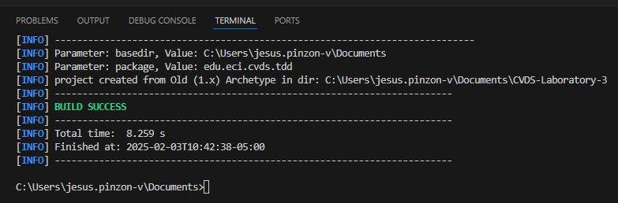
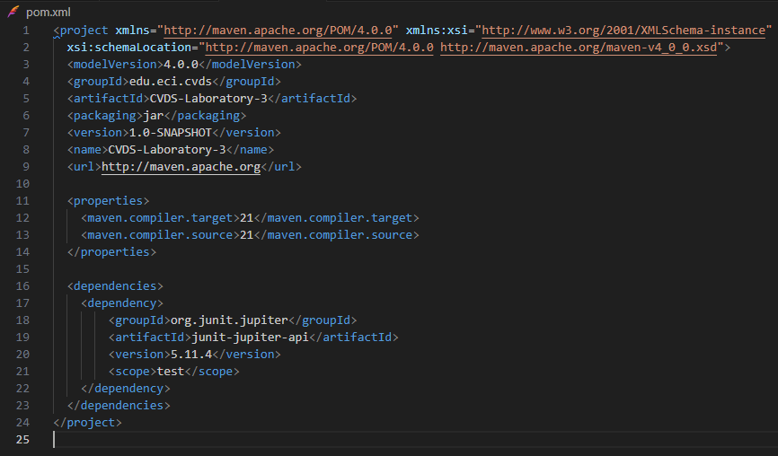
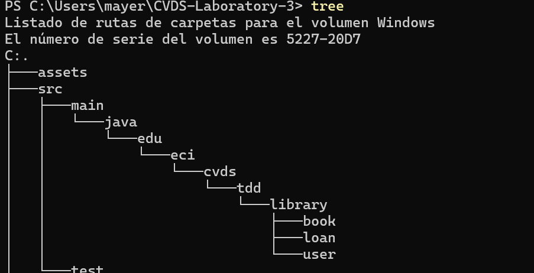
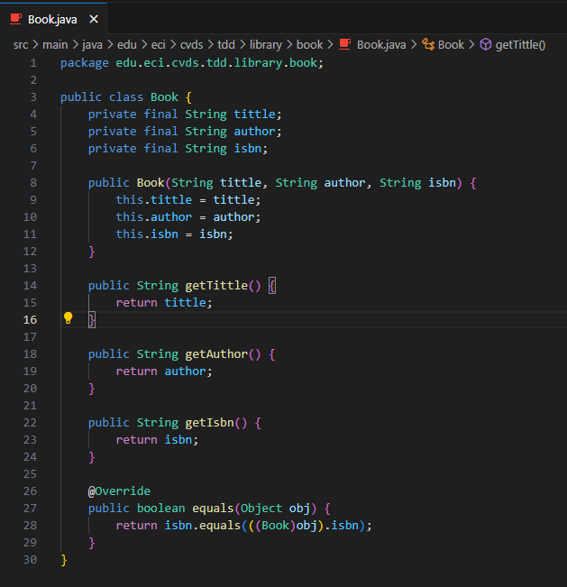
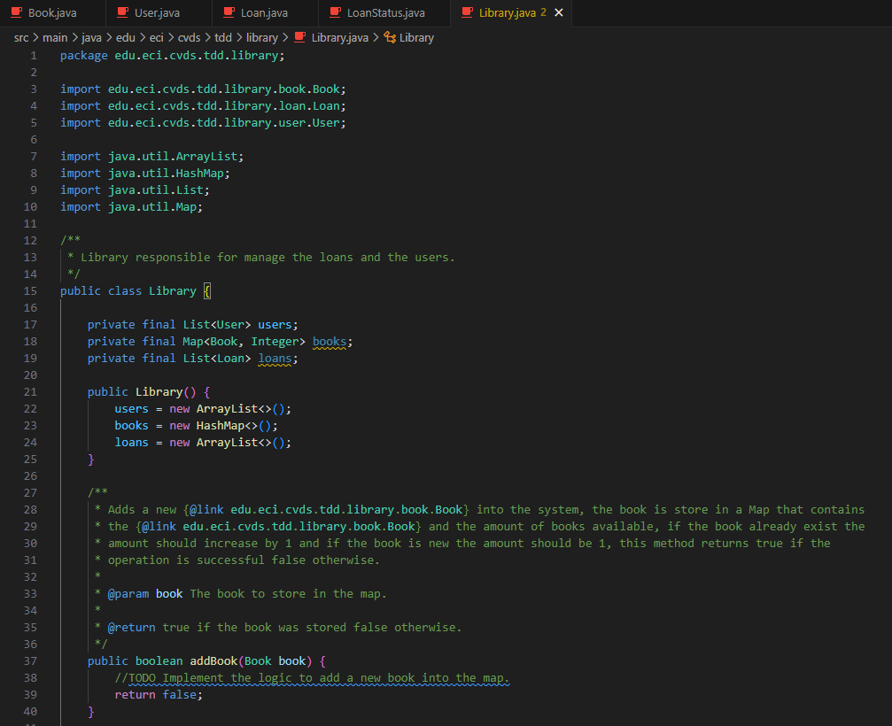
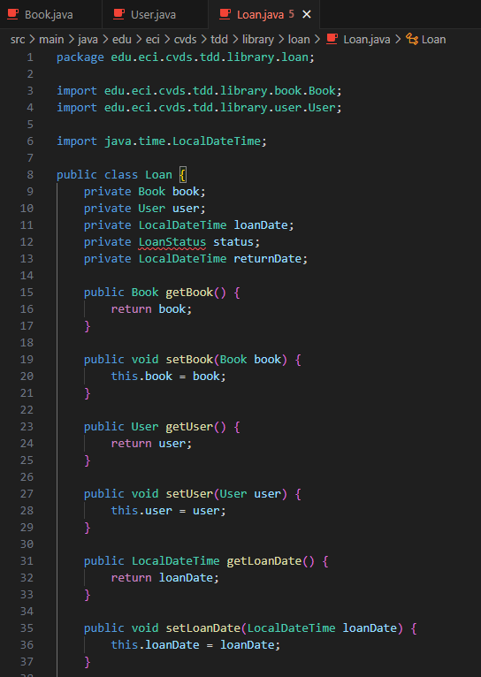
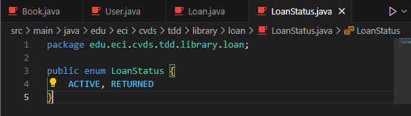
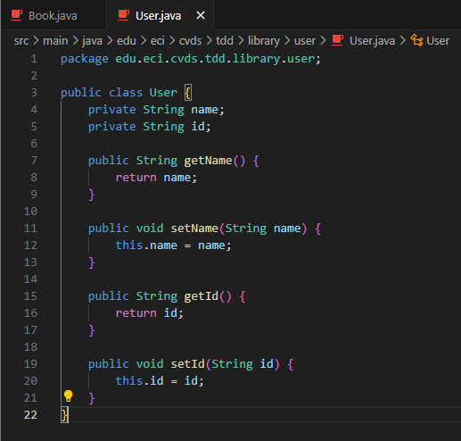
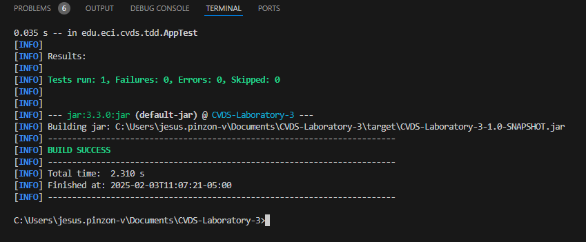
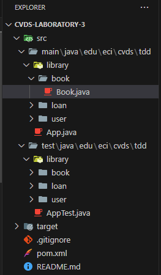

# CVDS-Laboratory-3

## Description

Library Management System using TDD with JUnit 5. Built with Java 17 and Maven, it manages books, users, and loans while ensuring availability and loan tracking. Includes unit tests, JaCoCo for code coverage, and SonarQube for static analysis.

## **Team Members**

- **Jesús Alfonso Pinzón Vega**  
  **GitHub Username**: [JAPV-X2612](https://github.com/JAPV-X2612) (Owner)  

- **José David Castillo Rodríguez**  
  **GitHub Username**: [JoseDavidCastillo](https://github.com/JoseDavidCastillo) (Collaborator)  

- **Mayerlly Suárez Correa**  
  **GitHub Username**: [corrllr](https://github.com/corrllr) (Collaborator)  

---
## PRE-REQUISITES
  - Java OpenJDK Runtime Environment: 21.x.x
  - Apache Maven: 3.9.x
  - JUnit: 5.x.x
  - Docker

## PRE-REQUISITES
  1. Learn how to write unit tests.
  2. Use the @Test annotation from the JUnit framework.
  3. Apply TDD (Test-Driven Development).

## CREATE A MAVEN PROJECT
  Create a Maven project with the following parameters:
  ```bash
    mvn archetype:generate -DgroupId=edu.eci.cvds -DartifactId=Library -Dpackage=edu.eci.cvds.tdd -DarchetypeArtifactId=maven-archetype-quickstart -DinteractiveMode=false
  ```
  
## ADD JUNIT5 DEPENDENCY
  - Search in Maven Central for the latest version of JUnit5.
  - Edit the pom.xml file of the project to add the dependency.
  - Make sure the Java version is set to 21:
  
  - Compile the project to verify everything is set up correctly.

## ADD PROJECT SKELETON
  Create the following packages within edu.eci.cvds.tdd:
  - book
  - loan
  - user
  

## ADD CLASSES
  In the edu.eci.cvds.tdd.library.book package, create the following class:
  

  Next, in the edu.eci.cvds.tdd.library.user package, create the following class:
  

  In the edu.eci.cvds.tdd.library.loan package, create the Loan class and the LoanStatus enum:
  
  

  Finally, create the Library class in the edu.eci.cvds.tdd.library package:
  

  To verify the project structure, compile it using the package command.
  

## UNIT TESTS AND TDD
  Create the test class for the Library class. This class should follow the appropriate name for tests in JUnit 5. Example: LibraryTest.
  Write the TDD tests:

  Step 1: Write a test case for the addBook method, which should fail initially.

  Step 2: Implement the addBook logic to pass the test.

  Repeat this process for the loanABook and returnLoan methods, making sure each test fails first and then implementing the logic to make it pass the test.

  

## CODE COVERAGE
 