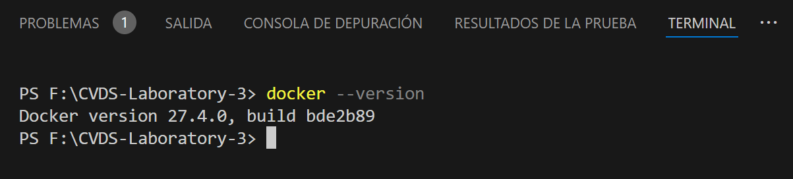

# **CVDS-Laboratory-3**

## **Description**

Library Management System using **TDD** with **JUnit 5**. Built with **Java 17** and **Maven**, it manages books, users, and loans while ensuring availability and loan tracking. Includes unit tests, **JaCoCo** for code coverage, and **SonarQube** for static analysis.

## **Team Members**

- **Jesús Alfonso Pinzón Vega**  
  **GitHub Username**: [JAPV-X2612](https://github.com/JAPV-X2612) (Owner)  

- **José David Castillo Rodríguez**  
  **GitHub Username**: [JoseDavidCastillo](https://github.com/JoseDavidCastillo) (Collaborator)  

- **Mayerlly Suárez Correa**  
  **GitHub Username**: [corrllr](https://github.com/corrllr) (Collaborator)  


## **1. PROJECT SETUP**

### **Prerequisites**

Before setting up the project, ensure you have the following installed:

- Java OpenJDK: 17.x.x
- Apache Maven: 3.9.x
- JUnit 5: Latest version
- Docker (for SonarQube analysis)


## **2. CREATING THE MAVEN PROJECT**

Create a Maven project with the following parameters:

```bash
  mvn archetype:generate -DgroupId=edu.eci.cvds -DartifactId=Library -Dpackage=edu.eci.cvds.tdd -DarchetypeArtifactId=maven-archetype-quickstart -DinteractiveMode=false
```


## **3. ADD JUNIT5 DEPENDENCY**

Modify the `pom.xml` file to include the latest JUnit 5 dependency:

```bash
<dependencies>
  <dependency>
      <groupId>org.junit.jupiter</groupId>
      <artifactId>junit-jupiter-api</artifactId>
      <scope>test</scope>
  </dependency>
</dependencies>
```

Ensure that the Java version is set to 21:

```bash
<properties>
  <maven.compiler.source>21</maven.compiler.source>
  <maven.compiler.target>21</maven.compiler.target>
</properties>
```


Compile the project using:

```bash
mvn package
```


## **4. PROJECT STRUCTURE**

Create the following packages within edu.eci.cvds.tdd:

- library

  - book
  - loan
  - user

These packages must also be created in the test folder.


## **5. ADD CLASSES**

In the `edu.eci.cvds.tdd.library.book` package, create the following class:


Next, in the `edu.eci.cvds.tdd.library.user` package, create the following class:


In the `edu.eci.cvds.tdd.library.loan` package, create the Loan class and the LoanStatus enum:


Finally, create the Library class in the `edu.eci.cvds.tdd.library` package:


To verify the project structure, compile it using the `mvn package` command.


Initial project folder structure:


## **6. UNIT TESTS AND TDD**

Create the test class for the `Library` class. This class should follow the appropriate name for tests in JUnit.

**Example:** `LibraryTest.java`

**Write the TDD tests:**

- **Step 1:** Write a test case for the addBook method, which should fail initially.

- **Step 2:** Implement the addBook logic to pass the test.

Repeat this process for the loanABook and returnLoan methods, making sure each test fails first and then implementing the logic to make it pass the test.


## **7. CODE COVERAGE**

* Add the jacoco dependency, use the latest version available on maven central.

  

* To use Jacoco you need to add the following section in the pom.xml

  ```bash
  <build>
    <plugins>
      <plugin>
        <groupId>org.jacoco</groupId>
        <artifactId>jacoco-maven-plugin</artifactId>
        <version>0.8.12</version>
        <executions>
          <execution>
            <goals>
              <goal>prepare-agent</goal>
            </goals>
          </execution>
          <execution>
            <id>report</id>
            <phase>test</phase>
            <goals>
              <goal>report</goal>
            </goals>
            <configuration>
              <excludes>
                <exclude>/configurators/</exclude>
              </excludes>
            </configuration>
          </execution>
          <execution>
          <id>jacoco-check</id>
          <goals>
            <goal>check</goal>
          </goals>
          <configuration>
            <rules>
              <rule>
                <element>PACKAGE</element>
                  <limits>
                    <limit>
                      <counter>CLASS</counter>
                      <value>COVEREDRATIO</value>
                      <minimum>0.85</minimum><!--Porcentaje mínimo de cubrimiento para construir el proyecto-->
                    </limit>
                  </limits>
                </rule>
              </rules>
            </configuration>
          </execution>
        </executions>
      </plugin>
    </plugins>
  </build>
  ```

  

  Now when compiling the project in the `target` folder, a folder with the name `site` must be created, which has an `index.html`. When opening this file on the web, the total **coverage** and that of each of the classes should be seen. The objective is to have coverage **greater than 90%**.

  ```bash
  mvn clean test
  ```

  

  


## **8. SONARQUBE**

Now we need to do static analysis of the code using [SonarQube](https://www.sonarsource.com/es/products/sonarqube/), for which we need to have [Docker](https://www.docker.com/).

- Once docker is installed, check the version in the terminal with the command `docker --version`
  
  

- Now the SonarQube service must be started with the following command `docker run -d --name sonarqube -e SONAR_ES_BOOTSTRAP_CHECKS_DISABLE=true -p 9000:9000 sonarqube:latest`

  

- Validate operation with the `docker ps -a` command

  

- Log in to sonar with port `localhost:9000` and change the default user and password.

  

  

  

- Enter account options `Account -> Settings -> Security -> Generate Tokens` and generete a new token

  

- Next, SonarLint must be installed in the IDE you are using. Here's how to do it for Visual Studio Code:

  
  

- Add the Sonar plugin to the project's `pom.xml` file

```bash
<plugin>
    <groupId>org.sonarsource.scanner.maven</groupId>
    <artifactId>sonar-maven-plugin</artifactId>
    <version>4.0.0.4121</version>
</plugin>
```


- Add SonarQube and Jacoco properties:

  ```bash
  <sonar.projectKey>library</sonar.projectKey>
  <sonar.projectName>library</sonar.projectName> 
  <sonar.host.url>http://localhost:9000</sonar.host.url>
  <sonar.coverage.jacoco.xmlReportPaths>target/site/jacoco/jacoco.xml</sonar.coverage.jacoco.xmlReportPaths>
  <sonar.coverage.exclusions>src//configurators/*</sonar.coverage.exclusions>
  ```

  

- Generate the integration with sonar through the command `mvn verify sonar:sonar -D sonar.token=[GENERATED_TOKEN]`

  

- Review the SonarQube dashboard results

  


## **9. SONARCLOUD**

Now, we are also going to integrate the project with SonarCloud. To do this, we must follow these steps:

- **Step 1:** Go to [SonarCloud](https://sonarcloud.io/login) and log in with [GitHub](https://github.com/).


- **Step 2:** On the dashboard, click + `Create new project`.

  

- **Step 3:** Select Analyze a new project and choose your repository.

  

- **Step 4:** Click `Set Up` and choose `Maven` as the analysis method.

  

- **Step 5:** Set **SonarCloud** in `pom.xml` file, adding the Sonar plugin in the `<build>` section:

  ```bash
  <plugin>
      <groupId>org.sonarsource.scanner.maven</groupId>
      <artifactId>sonar-maven-plugin</artifactId>
      <version>4.0.0.4121</version>
  </plugin>
  ```

  

  And in the `<properties>` section of the `pom.xml` file, add:

  ```bash
  <properties>
    <sonar.projectKey>JAPV-X2612_Library</sonar.projectKey>
    <sonar.organization>JAPV-X2612</sonar.organization>
    <sonar.host.url>https://sonarcloud.io</sonar.host.url>
    <sonar.coverage.jacoco.xmlReportPaths>target/site/jacoco/jacoco.xml</sonar.coverage.jacoco.xmlReportPaths>
    <sonar.coverage.exclusions>src//configurators/*</sonar.coverage.exclusions>
  </properties>
  ```

  

- **Step 6:** In [SonarCloud](https://sonarcloud.io/login), go to your profile, select `Security`, generate a new token and copy it.

  

- **Step 7:** In the terminal, run `mvn verify sonar:sonar -Dsonar.token=[YOUR_SONAR_TOKEN]`

  

- **Step 8:** After running the analysis, check the dashboard in [SonarCloud](https://sonarcloud.io/projects) to view the quality reports.

  


## **10. CONCLUSIONS**

The implementation of **Test-Driven Development (TDD)** in this laboratory ensured a structured and iterative coding process, leading to a more maintainable and robust system. Writing unit tests with JUnit 5 before implementing functionalities improved code reliability and facilitated early bug detection. Additionally, integrating **JaCoCo** allowed us to measure test coverage, ensuring that critical components were properly validated, reducing potential **technical debt**.

The use of **SonarQube** for static code analysis helped identify and address code quality issues, enforcing best practices and improving maintainability. Deploying **SonarQube** through **Docker** streamlined the analysis process, highlighting the relevance of automation in modern software development. These tools, combined with **Maven**, reinforced the importance of continuous integration and quality assurance, which are essential for building scalable and efficient software solutions.